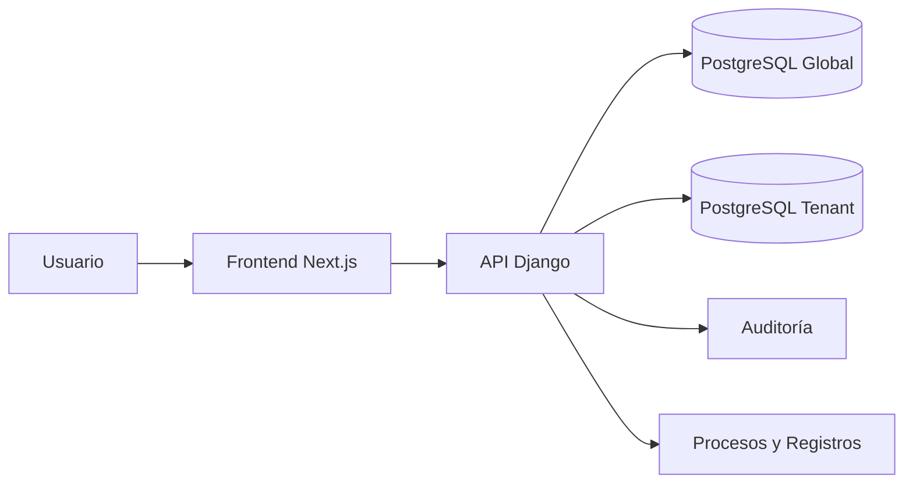

# Arquitectura inicial — Coldev-CADC refinada

## Objetivo arquitectónico

Construir una solución separada en:

- `frontend/` → Next.js
- `backend/` → Django

con PostgreSQL y arquitectura multitenant con aislamiento fuerte.

## Patrón general

### Patrón principal recomendado

**Arquitectura por capas + modular por dominio**

#### Frontend

- UI / páginas
- componentes
- hooks
- cliente API
- auth/session helpers
- documentación funcional visible y sincronizada con backend

#### Backend

- apps por dominio
- servicios de dominio
- modelos
- serializers / views
- auditoría
- resolución de tenant
- trazabilidad de proceso
- control de etapas operativas
- registros y acciones correctivas

## Responsabilidades

### Frontend

- presentar datos
- navegación
- estados de carga/error
- guards de sesión
- consumo de API

### Backend

- autenticación
- autorización
- resolución de tenant
- lógica de negocio
- persistencia
- auditoría
- seguridad de datos
- trazabilidad operativa
- control de flujo por etapa

## Diagrama de arquitectura

## Decisiones clave

- backend como fuente de verdad
- auth híbrida
- tenant por subdominio con fallback por slug
- base global + base por tenant
- separación de proyectos
- referencia documental usada solo de forma anonimizada
- trazabilidad por lote como eje del dominio
- proceso operacional modelado como etapas configurables

## Dominios backend recomendados

- `core` — tenant registry, configuración base, resolución de tenant
- `authentication` — auth híbrida y sesión
- `users` — usuarios, roles, permisos, membresías
- `audit` — eventos, bitácora, acciones sensibles
- `catalog` — productos, especies, presentaciones
- `reception` — recepción de materia prima, proveedor, embarcación, inspección sensorial
- `process` — etapas, registros de proceso, estados de lote
- `quality` — formularios, controles PCC, aprobaciones
- `dispatch` — empaque, reempaque, almacenamiento final y despacho

## Riesgos a controlar

- fuga de datos entre tenants
- mezclar dominio en frontend
- crecer sin documento funcional consolidado
- modelar BD sin validar reglas reales de negocio
- citar o reutilizar datos reales de la referencia documental
