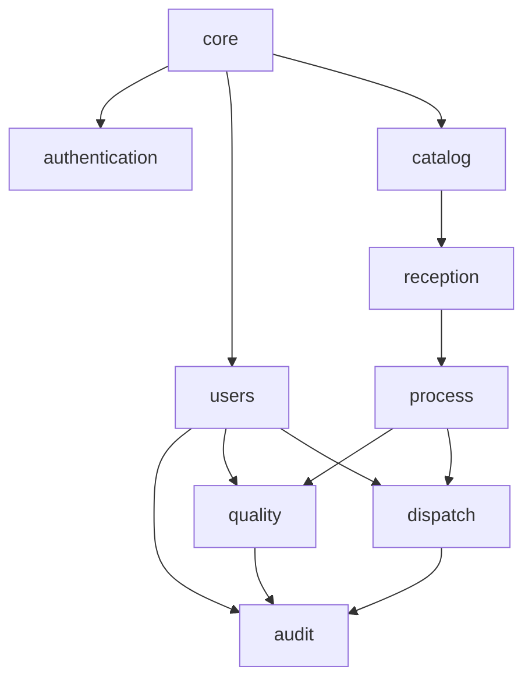

# Backend Django — apps y modelos propuestos

> Propuesta base para Coldev-CADC.  
> Usa referencia documental **anonimizada** y el frontend actual solo como apoyo funcional.

## Objetivo

Definir una estructura de backend Django:

- clara por dominios
- compatible con multitenancy fuerte
- alineada con trazabilidad por lote
- preparada para crecer sin mezclar responsabilidades

## Regla general

La base del backend se organiza por **dominios de negocio**, no por pantallas del frontend.

## Estructura propuesta de apps

```text
backend/apps/
  core/
  authentication/
  users/
  audit/
  catalog/
  reception/
  process/
  quality/
  dispatch/
```

---

## 1. `core`

### Responsabilidad

- multitenancy
- configuración global
- registro de tenants
- resolución de tenant
- metadatos globales de plataforma

### Modelos propuestos

- `TenantRegistry`
  - slug
  - name
  - db_alias
  - db_name
  - subdomain
  - status
  - plan
  - created_at
  - updated_at

- `TenantSettings`
  - tenant
  - timezone
  - locale
  - feature_flags
  - business_rules

- `PlanDefinition`
  - code
  - name
  - limits
  - enabled_modules

- `LicenseRecord`
  - tenant
  - plan
  - status
  - valid_from
  - valid_until

---

## 2. `authentication`

### Responsabilidad

- login
- logout
- refresh / sesión híbrida
- políticas de autenticación
- intentos de acceso

### Modelos propuestos

- `AuthSession`
  - user
  - tenant
  - session_mode
  - issued_at
  - expires_at
  - last_seen_at
  - is_active

- `LoginAttempt`
  - tenant
  - username
  - source_ip
  - user_agent
  - result
  - created_at

- `RefreshTokenRecord` *(si se usa refresh token persistido)*
  - user
  - tenant
  - token_hash
  - expires_at
  - revoked_at

> Nota: aquí pueden convivir sesión por cookie HTTP-only + refresh/token de apoyo, según se cierre la auth híbrida.

---

## 3. `users`

### Responsabilidad

- usuarios
- roles
- permisos
- membresía tenant-aware

### Modelos propuestos

- `User`
  - username
  - first_name
  - last_name
  - email
  - is_active
  - is_staff
  - created_at
  - updated_at

- `Role`
  - code
  - name
  - scope
  - description

- `PermissionDefinition`
  - code
  - name
  - module
  - description

- `RolePermission`
  - role
  - permission

- `UserMembership`
  - user
  - tenant
  - role
  - is_active
  - joined_at
  - last_login_at

### Roles iniciales sugeridos

- `global_admin`
- `tenant_admin`
- `manager`
- `quality_manager`
- `monitor`
- `production_supervisor`

---

## 4. `audit`

### Responsabilidad

- bitácora transversal
- acciones sensibles
- trazabilidad de decisiones
- evidencias de acceso

### Modelos propuestos

- `AuditEvent`
  - tenant
  - actor
  - action
  - level
  - object_type
  - object_id
  - metadata
  - created_at

- `SecurityEvent`
  - tenant
  - actor
  - event_type
  - result
  - source_ip
  - details
  - created_at

---

## 5. `catalog`

### Responsabilidad

- especies
- productos
- presentaciones
- configuraciones comerciales básicas

### Modelos propuestos

- `Species`
  - common_name
  - scientific_name
  - category
  - is_active

- `Product`
  - tenant
  - species
  - code
  - name
  - line_type
  - product_type
  - shelf_life_days
  - storage_temperature_min
  - storage_temperature_max

- `ProductPresentation`
  - product
  - code
  - name
  - description
  - is_active

---

## 6. `reception`

### Responsabilidad

- recepción de materia prima
- proveedor
- embarcación
- documentos de origen
- controles iniciales

### Modelos propuestos

- `Supplier`
  - tenant
  - name
  - tax_id
  - supplier_type
  - status

- `Vessel`
  - tenant
  - name
  - registration_number
  - authorized_for_market
  - status

- `TransportUnit`
  - tenant
  - plate
  - driver_name
  - transport_type

- `RawMaterialReception`
  - tenant
  - lot_code
  - supplier
  - vessel
  - transport_unit
  - product
  - presentation
  - origin_description
  - destination_description
  - guide_number
  - received_kilos
  - received_at
  - received_temperature
  - documents_ok
  - status

- `SensoryInspection`
  - reception
  - odor_score
  - color_score
  - texture_score
  - external_aspect_score
  - contamination_check
  - thermometer_id
  - accepted
  - notes

- `CorrectiveAction`
  - tenant
  - source_type
  - source_id
  - action_type
  - description
  - executed_by
  - executed_at
  - status

---

## 7. `process`

### Responsabilidad

- lote operacional
- etapas
- flujo de proceso
- trazabilidad por avance

### Modelos propuestos

- `Lot`
  - tenant
  - code
  - product
  - presentation
  - source_reception
  - status
  - quantity_kg
  - created_at

- `ProcessStage`
  - tenant
  - code
  - name
  - order_index
  - is_optional
  - stage_type

- `LotStageRecord`
  - tenant
  - lot
  - stage
  - started_at
  - finished_at
  - responsible_user
  - status
  - temperature
  - observations

- `StageMeasurement`
  - stage_record
  - measurement_type
  - value
  - unit
  - measured_at

### Etapas iniciales sugeridas

- recepción
- almacenamiento_inicial
- eviscerado_limpieza_corte
- fileteo
- almacenamiento_intermedio
- pesaje_emparrillado
- congelacion_enfriado
- empaque_reempaque
- almacenamiento_final
- despacho

---

## 8. `quality`

### Responsabilidad

- formularios
- controles PCC
- aprobaciones
- validaciones de calidad

### Modelos propuestos

- `FormTemplate`
  - tenant
  - code
  - name
  - process_stage
  - status

- `FormFieldTemplate`
  - form_template
  - code
  - label
  - field_type
  - required
  - rules

- `FormSubmission`
  - tenant
  - form_template
  - lot
  - submitted_by
  - status
  - submitted_at
  - approved_at

- `FormFieldValue`
  - submission
  - field_template
  - value_text
  - value_number
  - value_boolean

- `CCPRecord`
  - tenant
  - lot
  - process_stage
  - measured_by
  - parameter_name
  - value
  - limit_value
  - result
  - recorded_at

- `Approval`
  - tenant
  - submission
  - reviewer
  - decision
  - reason
  - decided_at

---

## 9. `dispatch`

### Responsabilidad

- empaque
- reempaque
- almacenamiento final
- despacho
- trazabilidad de salida

### Modelos propuestos

- `PackagingRecord`
  - tenant
  - lot
  - packaging_type
  - net_weight
  - package_count
  - labeled_at
  - repack_code

- `LabelRecord`
  - packaging
  - product_name
  - scientific_name
  - presentation
  - plant_code
  - production_date
  - expiration_date
  - lot_code
  - storage_text

- `ColdStorageRecord`
  - tenant
  - lot
  - storage_type
  - temperature
  - started_at
  - ended_at

- `DispatchRecord`
  - tenant
  - lot
  - transport_unit
  - dispatched_at
  - destination
  - dispatch_temperature
  - status

---

## Orden recomendado de implementación de modelos

### Fase 1 — slice actual

1. `core`
2. `authentication`
3. `users`
4. `audit`

### Fase 2 — trazabilidad de origen

5. `catalog`
6. `reception`
7. `process`

### Fase 3 — calidad y salida

8. `quality`
9. `dispatch`

---

## Dependencias clave entre apps



---

## Recomendación final

Para no bloquear el avance:

- implementar **ahora** solo lo mínimo de `core`, `authentication`, `users` y `audit`
- dejar `catalog`, `reception`, `process`, `quality` y `dispatch` ya definidos a nivel documental
- luego abrir cambios SDD específicos por dominio

## Nota de diseño

Esta estructura está pensada para:

- crecer con orden
- evitar mezclar formularios con logística o seguridad
- permitir trazabilidad real
- mantener multitenancy fuerte
- facilitar reporting futuro sobre PostgreSQL y BI
