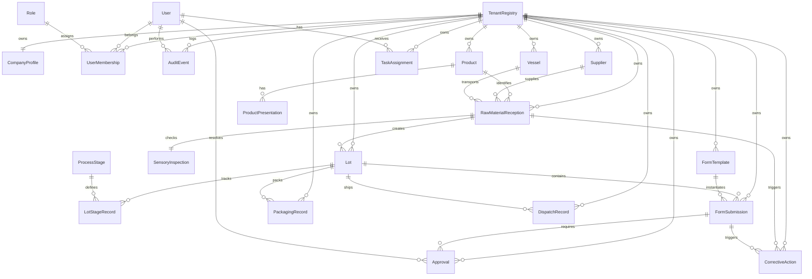

# Modelo conceptual inicial de base de datos refinado

> Basado en frontend + referencia documental operacional anonimizada.  
> Pendiente de consolidación final contra reglas funcionales completas.

## Entidades principales inferidas

- TenantRegistry
- CompanyProfile
- User
- Role
- UserMembership
- AuditEvent
- Supplier
- Vessel
- RawMaterialReception
- SensoryInspection
- Lot
- Product
- ProductPresentation
- ProcessStage
- LotStageRecord
- FormTemplate
- FormSubmission
- TaskAssignment
- Approval
- PackagingRecord
- DispatchRecord
- CorrectiveAction

## Relaciones conceptuales

## Núcleo inicial recomendado

### Global DB

- `tenant_registry`
- `global_plans`
- `global_licenses`
- `global_audit` opcional mínimo

### Tenant DB

- `users`
- `roles`
- `user_memberships` o equivalente tenant-aware
- `audit_events`
- `company_profile`
- `suppliers`
- `vessels`
- `raw_material_receptions`
- `sensory_inspections`
- `products`
- `product_presentations`
- `lots`
- `process_stages`
- `lot_stage_records`
- `form_templates`
- `form_submissions`
- `task_assignments`
- `approvals`
- `packaging_records`
- `dispatch_records`
- `corrective_actions`

## Prioridad inmediata para modelado real

Primero cerrar:

1. tenant
2. user
3. role
4. membership
5. audit_event
6. supplier
7. raw_material_reception
8. lot
9. process_stage
10. lot_stage_record

Después:

11. form_template
12. form_submission
13. approval
14. packaging_record
15. dispatch_record
16. corrective_action

## Nota

Este documento no reemplaza el diseño definitivo de BD; es una base para conversar y refinar cuando llegue el documento fuente real.
